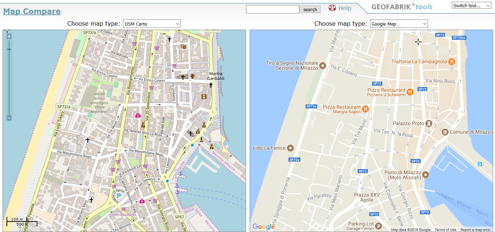
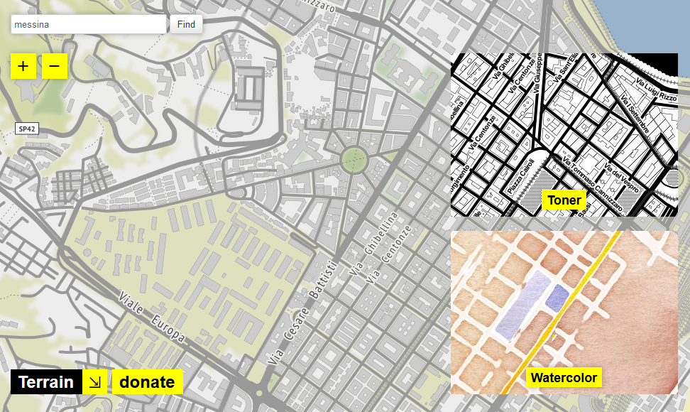
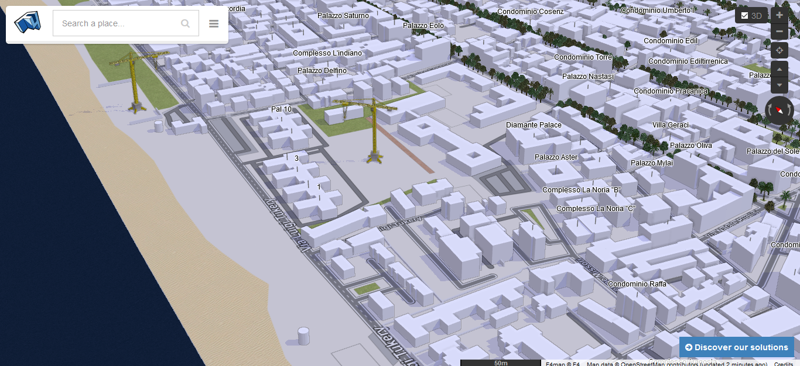
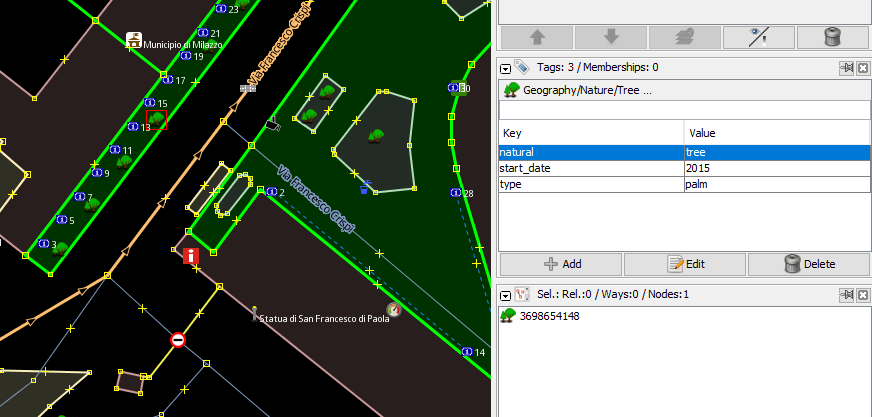
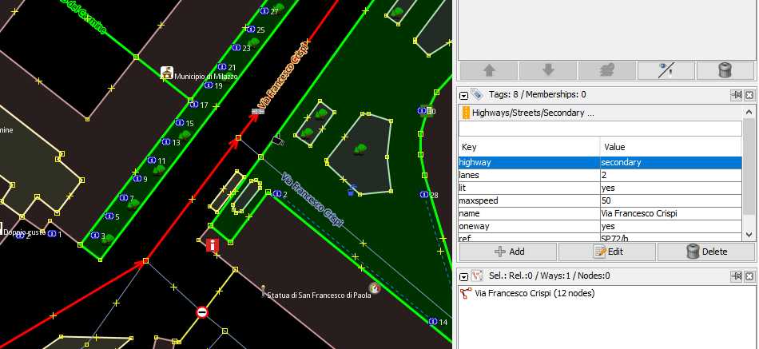
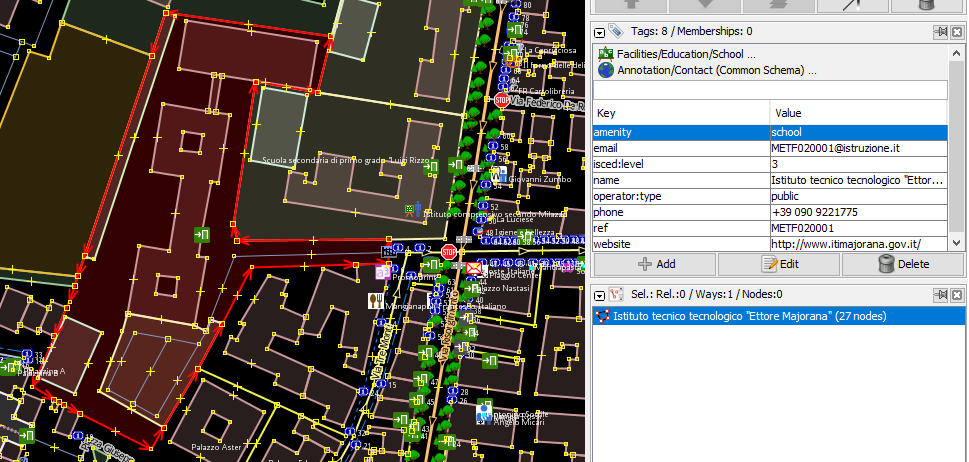
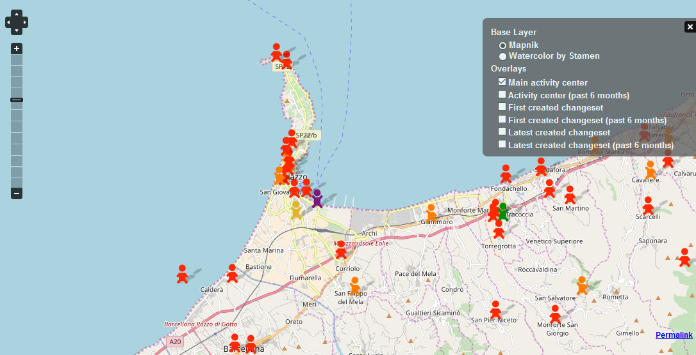
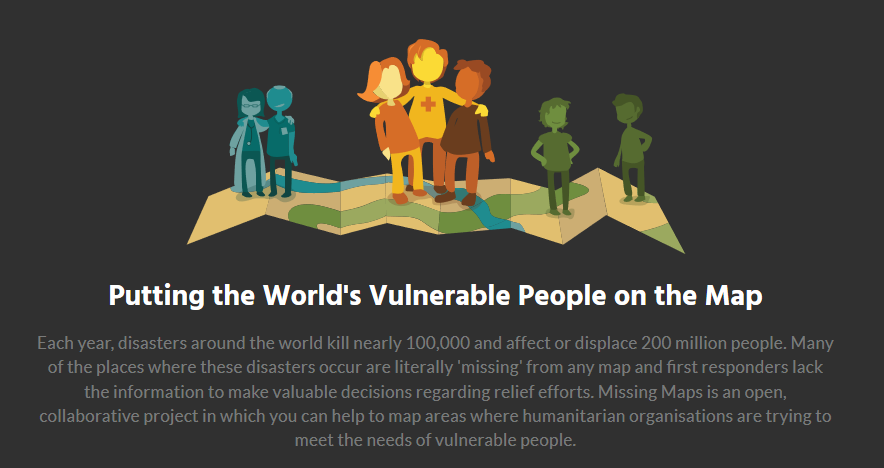

## OpenstreetMap

### Dati Geografici Aperti
#### [Andrea Borruso](https://twitter.com/aborruso/) ([Associazione onData](http://ondata.it/))

+++

## Presentazioni

- Faccio "cose" con i dati, con una preferenza per i **dati spaziali**;
- sono uno dei fondatori dell'**Associazione onData**, "per la promozione della trasparenza e della **cultura dei dati** attraverso le competenze digitali e il giornalismo investigativo";
- mi prendo cura di **[OpenDataSicilia](http://opendatasicilia.it/)**

**email**: aborruso@gmail.com | **twitter**: [@aborruso](https://twitter.com/aborruso)
---?image=imgs/OpenStreetMap-Data-Report.png

## Cosa è OpenStreetMap?

+++

> OpenStreetMap è una mappa del mondo, **creata da persone come te** e **libera da utilizzare** secondo una **licenza aperta**.

+++

- l'avete mai usata?
- c'è un sito web "famoso" che vi fa pensare a OpenStreetMap?

+++

+++

Cosa ha questo video di speciale?

---

# Anagrafica

- homepage [https://www.openstreetmap.org](https://www.openstreetmap.org);
- mailing list [http://gis.19327.n8.nabble.com/Italy-f5324173.html];(http://gis.19327.n8.nabble.com/Italy-f5324173.html);
- le guide per iniziare:
  - [il wiki di OSM](https://wiki.openstreetmap.org/wiki/IT:Beginners%27_guide)
  - [learnOSM](http://learnosm.org/it/)

+++

[Partiamo da noi](https://www.openstreetmap.org/#map=18/38.22174/15.23622)

+++

[confronto](https://tools.geofabrik.de/mc/#16/38.2201/15.2380&num=2&mt0=mapnik&mt1=google-map)

+++

[di tutti i colori](http://maps.stamen.com/#terrain/16/38.1848/15.5505)

+++

[3D](http://demo.f4map.com/#lat=38.2204431&lon=15.2421646&zoom=15&camera.theta=0.9)

---

## Come funziona?

+++

### Il modello dei dati

+++
### nodi

+++

### ways

### relazioni

---

## [Cosa si mappa](https://taginfo.openstreetmap.org/)?

---

## Chi la fa funzionare

+++

[Chi?](http://resultmaps.neis-one.org/oooc?zoom=12&lat=38.21798&lon=15.26903&layers=B0TFFFFFT)

---

## Che cosa ci si fa

+++

#### L'eccezionale Missing Maps

+++

+++

### Per la conservazione digitale dei beni culturali

La Villa Romana di Patti Marina: [1](http://www.telebitconsulting.it/infopatti/npc15/npc15_villa_romana.html), [2](https://tools.geofabrik.de/mc/#18/38.1490/14.9723&num=2&mt0=mapnik&mt1=google-map)

+++

## [Le rastrelliere di Bologna](https://ondata.github.io/rastrellierebologna/)

Il [wiki](https://github.com/ondata/rastrellierebologna)

---

