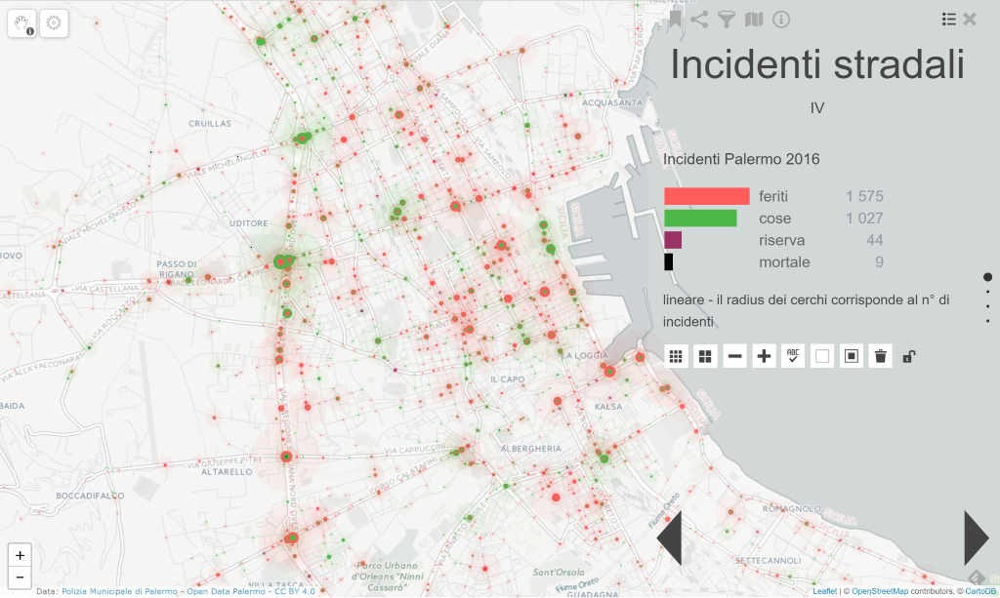
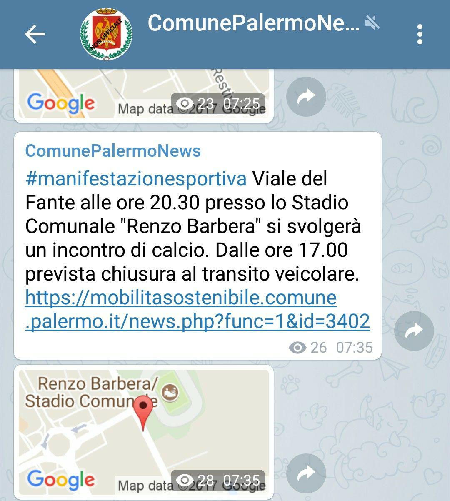
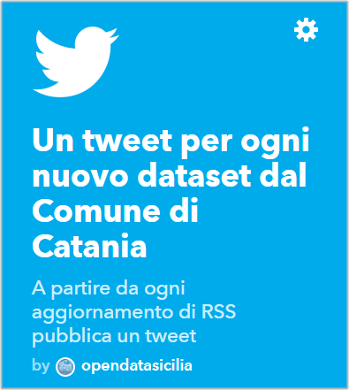
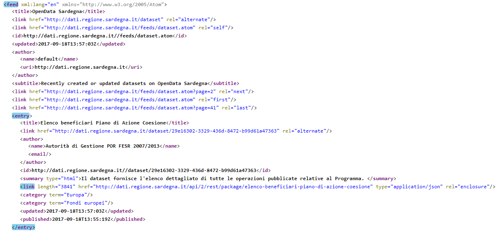
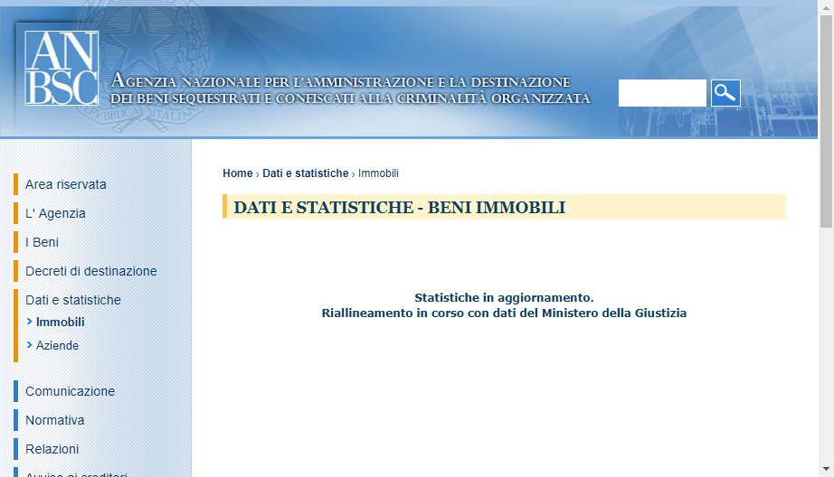
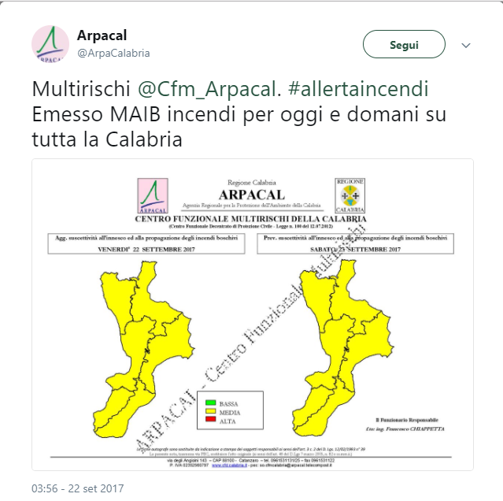

#### Riuso dei dati nelle emergenze e nelle iniziative di cittadinanza attiva
<br>
<span style="color:gray">OpenRAS</span>
<br>
<span style="color:gray"></span>
<br>
<span style="color:gray"><a href="https://twitter.com/aborruso" target="_blank">@aborruso</a></span>

+++

# me

<span style="color:white">Sono un geomatico</span>

<span style="color:white">Mi occupo rilevamento e trattamento informatico
dei dati relativi alla terra e all’ambiente.</span>

+++

# qui, sono un civic hacker

+++?image=imgs/avengers_age_of_ultron_2015_movie-wide.jpg&size=contain

## NON SIAMO COSÌ

+++

[civichacking.it](http://civichacking.it)


+++

# Casi e storie di riuso, nel bene e nel male

+++

# Il riuso come conseguenza

+++

```XML
<item>
<guid>
https://mobilitasostenibile.comune.palermo.it/news.php?func=1&id=3401
</guid>
<title>Lavori in corso</title>
<description>
Via Sardegna,42 possibili rallentamenti al flusso veicolare causa lavori urgenti di costruzione nuovo allaccio fognario.
</description>
<link>
https://mobilitasostenibile.comune.palermo.it/news.php?func=1&id=3401
</link>
<author>webmaster@comune.palermo.it (Comune di Palermo)</author>
<category>Tweet PM</category>
<pubDate>Mon, 25 Sep 2017 07:24:24 GMT</pubDate>
<geo:lat>38.1453565</geo:lat>
<geo:long>13.333013599999958</geo:long>
</item>
```
+++

["Palermo Incidenti"](https://goo.gl/gpFujg) di [Guenter Richter](https://mobile.twitter.com/grichter)


+++



+++

## È pop

### Non è soltanto per "tecnici"

STANDARD > **RSS** > Decine di modalità d'uso per tutti!

+++?image=imgs/louisville.png&size=contain

+++

## Il riuso per la crescita della **consapevolezza**



+++

[http://dati.regione.sardegna.it/feeds/dataset.atom](http://dati.regione.sardegna.it/feeds/dataset.atom)



+++

# Il riuso come necessità

+++



+++?image=imgs/ANBSC2.png&size=contain

+++

**Impossibile fare monitoraggio** > **siamo stati costretti a fare riuso**

+++

- scraping
- pulizia
- arricchimento
- condivisione
- raggruppamento
- analisi

+++



+++
Andrea Borruso

[@aborruso](https://twitter.com/aborruso) | [aborruso@gmail.com](mailto:aborruso@gmail.com)