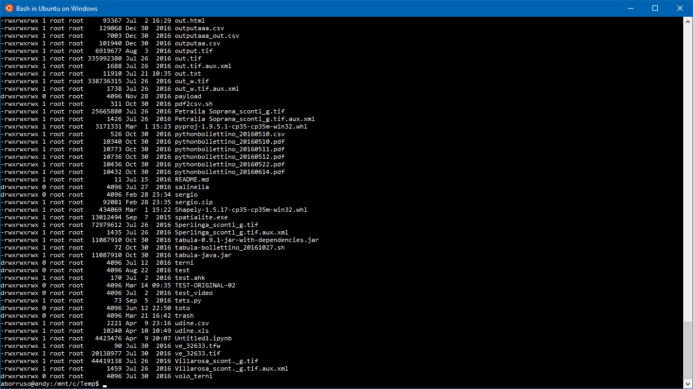

#### dati da riga di comando
 
Roba vecchia, molto innovativa
 

 
<a href="https://twitter.com/aborruso" target="_blank">@aborruso</a>

+++

# whoIam
Sono un geomatico

Mi occupo rilevamento e trattamento informatico
dei dati relativi alla terra e all’ambiente.

---

# Non parliamo di dati aperti

---

# Andiamo a commandare

+++

## Fare cose nuove con strumenti del 1960?

+++

+++?image=imgs/pipes.jpg

+++?image=imgs/lemmings.jpg